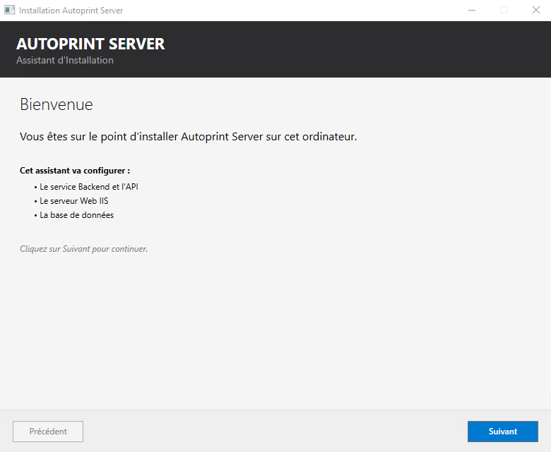
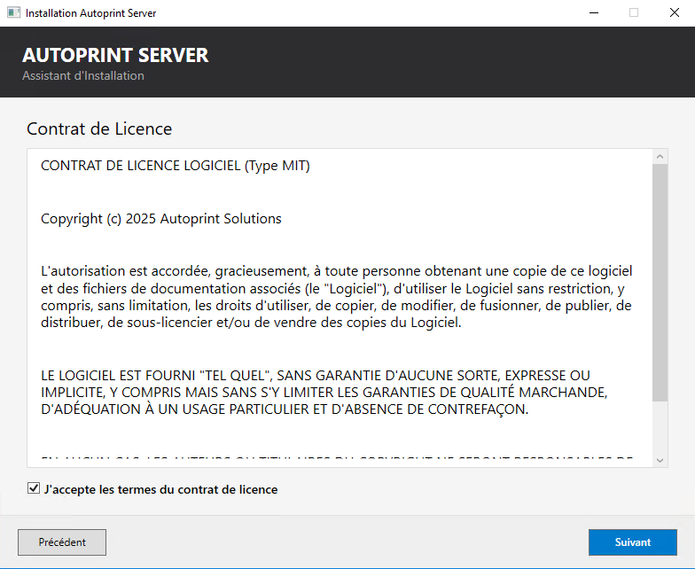
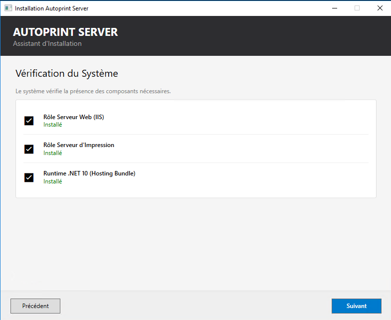
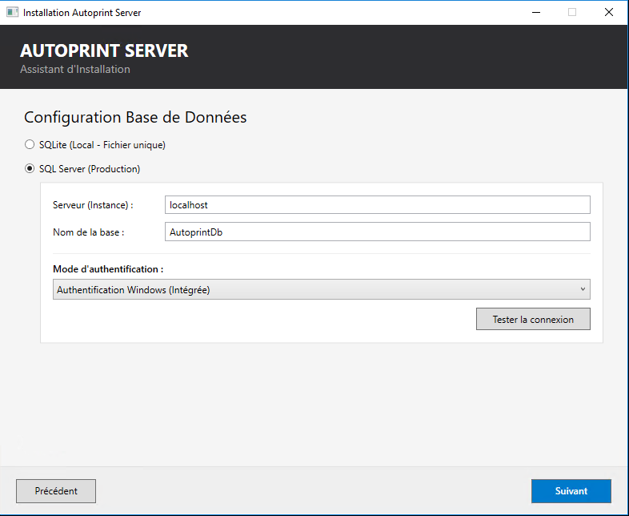
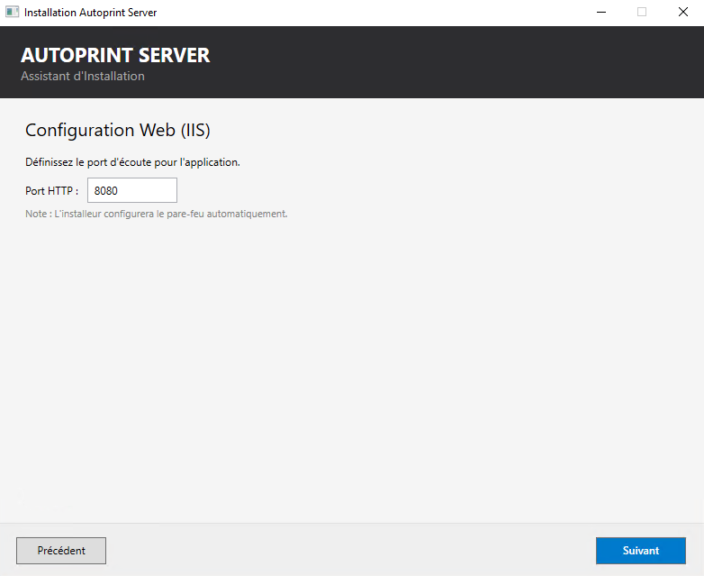
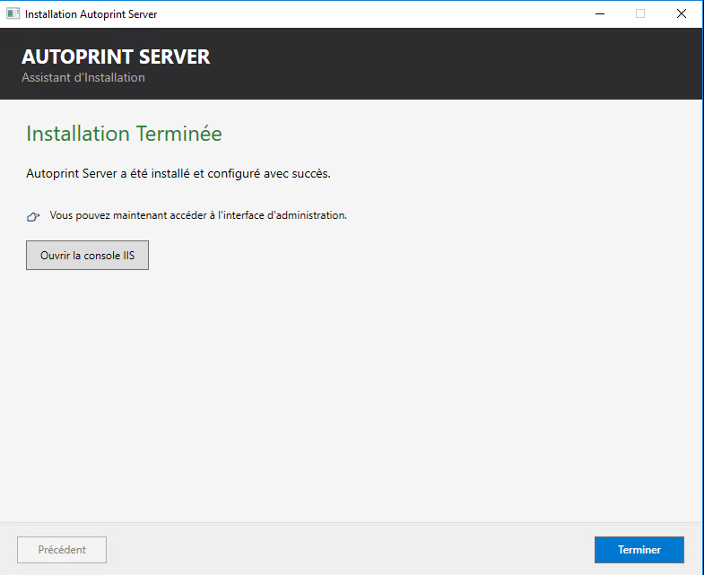
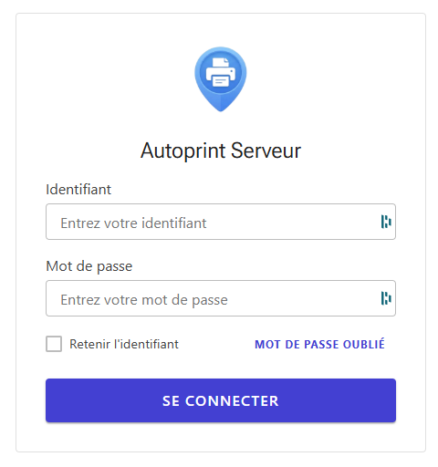
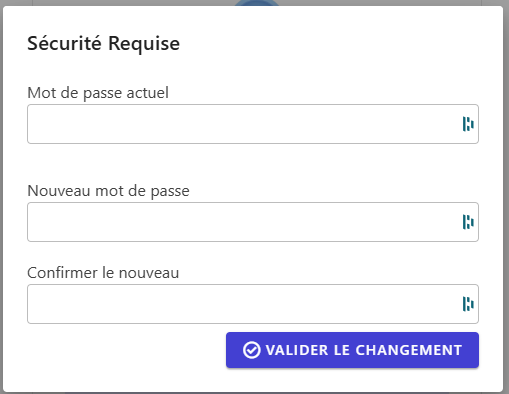
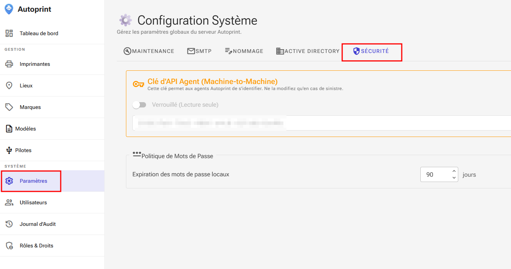

#  Guide d'Installation - Autoprint Server

Ce guide détaille les étapes pour installer et configurer la partie serveur de la solution Autoprint sur un environnement Windows Server.

## 1. Installation du Serveur

Lancez l'exécutable `Autoprint.Server.Setup.exe`. L'assistant va se charger d'installer l'application, de configurer le pool IIS et d'initialiser la base de données.

### Étape 1 : Bienvenue
L'assistant vous présente les composants qui seront configurés.

### Étape 2 : Licence
Veuillez lire et accepter le contrat de licence (MIT) pour continuer.

### Étape 3 : Vérification Système
Le launcher vérifie la présence des pré-requis (IIS, Rôle Impression, .NET 10).
> **Note :** Si un composant est manquant, un bouton "Installer" apparaîtra pour corriger le problème automatiquement.

### Étape 4 : Base de Données
Choisissez votre moteur de base de données :
* **SQLite (Par défaut) :** Idéal pour les petits déploiements. Un fichier `.db` sera créé localement.
* **SQL Server :** Recommandé pour la production. Un test de connexion sera effectué avant validation.

### Étape 5 : Configuration Web (IIS)
Définissez le port d'écoute HTTP (Défaut : `8080`).
⚠️ **Important :** Pour la production, il est impératif de configurer un certificat SSL (HTTPS) dans la console IIS après l'installation.

### Étape 6 : Finalisation
L'installation est terminée. Vous pouvez cliquer sur "Ouvrir la console IIS" pour finaliser la configuration réseau (Binding HTTPS).

---

## 2. Configuration Post-Installation

### Configuration IIS (Recommandé)
Une fois l'installation terminée :
1.  Ouvrez la console IIS (`inetmgr`).
2.  Ajoutez une liaison **HTTPS (Port 443)** avec un certificat valide.
3.  (Optionnel) Supprimez la liaison HTTP (Port 8080) pour sécuriser les flux.
4.  Redémarrez le site Web.

---

## 3. Première Connexion

Accédez à l'interface d'administration via votre navigateur (ex: `https://localhost` ou `http://localhost:8080`).

### Identifiants par défaut
* **Utilisateur :** `admin`
* **Mot de passe :** `admin123`

### Sécurité Initiale
À la première connexion, le système détecte que le mot de passe est expiré. Vous devez obligatoirement définir un nouveau mot de passe sécurisé pour continuer.

---

## 4. Préparation pour les Clients

Pour installer l'agent sur les postes utilisateurs, vous aurez besoin de la **Clé d'API (Machine-to-Machine)**.

Allez dans : **Paramètres > Sécurité > Clé d’API Agent**

Copiez cette clé, elle sera demandée lors de l'installation du package MSI client (`APIKEY=...`).