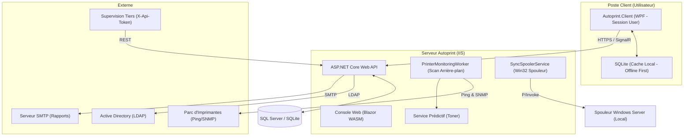

# 🖨️ Autoprint V2

[](https://dotnet.microsoft.com/)
[](https://dotnet.microsoft.com/apps/aspnet/web-apps/blazor)
[](https://github.com/dotnet/wpf)
[](https://www.microsoft.com/sql-server)
[](LICENSE)

**Autoprint** est une solution moderne de gestion d'impression et de supervision de parc d'imprimantes pour environnements Windows. Conçue pour résoudre les problématiques de mobilité (roaming) et simplifier le déploiement de files d'attente d'impression (Zero-Trust/Intune), elle intègre désormais dans sa version **V2** un moteur de supervision réseau proactif et intelligent.

---

## 🌟 Fonctionnalités Clés

### 🎛️ Gestion et Déploiement Agile
* **Location Awareness (Détection de Lieu)** : L'agent utilisateur détermine automatiquement son emplacement physique en analysant les plages d'adresses IP (CIDR) et propose les imprimantes disponibles à proximité.
* **Mode Filiale (Direct IP)** : Option de contournement du serveur d'impression (Direct Branch Office Printing) pour les sites distants à faible bande passante, en configurant les files d'impression directement vers les imprimantes réseau.
* **Synchronisation Staging** : Dissociation entre les configurations en base de données et l'état réel du spouleur d'impression Windows. Les administrateurs prévisualisent et appliquent les modifications de façon centralisée.

### 📡 Supervision et Intelligence (Nouveautés V2)
* **Diagnostics Réseau & SNMP en Direct** : Test de connectivité (Ping) et interrogation d'état à la demande des imprimantes.
* **Scan Automatique d'Arrière-plan** : Collecte périodique et autonome de l'état de santé du parc d'impression.
* **Prédiction d'Épuisement de Toner** : Algorithme prévisionnel qui anticipe le nombre de jours restants avant rupture, à partir de l'historique d'utilisation (`TonerHistory`).
* **Profils SNMP par Marque** : Surcharge personnalisée des requêtes OIDs pour les imprimantes hors standards constructeurs.
* **Rapports SMTP Planifiés** : Envoi de résumés d'état périodiques (compteurs, consommables) par e-mail en PDF ou CSV.
* **Jetons d'Intégration API** : Export des données de supervision vers des outils tiers (GLPI, PRTG, Zabbix) via des clés sécurisées (`X-Api-Token`).

### 🛡️ Sécurité de Niveau Production (V2)
* **Architecture Zéro-Privilège** : Retrait du service Windows local pour éliminer les risques d'élévation de privilèges (LPE). L'agent s'exécute uniquement dans la session utilisateur.
* **Chiffrement & Certificats** : Validation SSL/TLS stricte pour sécuriser les échanges entre les postes clients et le serveur.
* **Hachage Moderne** : Protection des mots de passe locaux via l'algorithme PBKDF2 salé avec migration transparente.
* **Désinfection des Entrées** : Protection contre les injections LDAP (annuaire AD) et les injections d'arguments système.

---

## 🏗️ Architecture Système (V2)



---

## 🛠️ Stack Technique

* **Serveur Back-end** : ASP.NET Core API (.NET 10) & Entity Framework Core.
* **Console d'Administration** : Blazor WebAssembly avec composants Radzen.
* **Agent Utilisateur** : WPF (.NET 10) léger & Base locale SQLite (Offline-First).
* **Base de Données** : SQL Server (Production) / SQLite (Développement).
* **Communication** : API REST HTTPS, WebSockets SignalR (Push-to-Pull) et API Win32 Native (`winspool.drv`).

---

## 📂 Structure du Dépôt

* `Autoprint.Client` : Code source de l'agent de bureau WPF.
* `Autoprint.Client.Setup` : Projet WiX Toolset pour la compilation du package d'installation MSI client.
* `Autoprint.Server` : API Web ASP.NET Core et services d'arrière-plan (scan, prédiction, rapports).
* `Autoprint.Server.Setup` : Projet WiX Toolset pour la création du package MSI serveur.
* `Autoprint.Installer.Server.UI` : Assistant d'installation WPF du serveur.
* `Autoprint.Shared` : Modèles de données, DTOs et classes partagées.
* `Autoprint.Web` : Application Blazor WASM (Console d'administration).
* `Docs/` : Guides d'installation, manuels et documentation d'architecture technique.

---

## 🚀 Installation & Déploiement

### Déploiement du Serveur
L'installation est automatisée via un assistant WPF interactif (`Autoprint.Server.Setup.exe`) :
1. Analyse des prérequis système (IIS, rôles d'impression, Runtime .NET 10).
2. Configuration de la base de données (détection SQL Server ou SQLite local).
3. Provisionnement et démarrage du site dans IIS.

### Déploiement Silencieux des Clients
Le client s'installe via un package MSI standard, idéal pour un déploiement de masse (Intune, GPO ou SCCM) :

```cmd
msiexec /i AutoprintClient.msi PRINTSERVER="https://serveur-autoprint.corp" APIKEY="votre-cle-api-agent" /qn
```
* **PRINTSERVER** : URL HTTPS de votre serveur Autoprint.
* **APIKEY** : Clé de sécurité machine-to-machine générée sur la console web dans *Paramètres > Clé d'API Agent*.

---

*Autoprint - Solution de Gestion Dynamique et Supervision d'Impression pour Entreprises.*